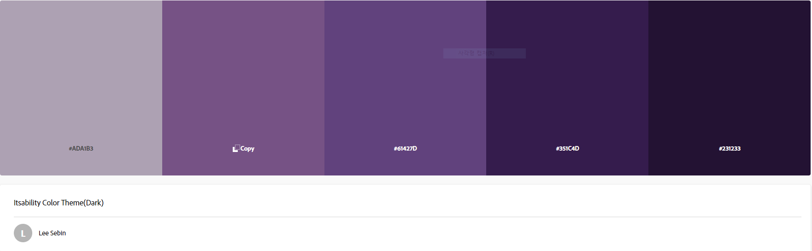
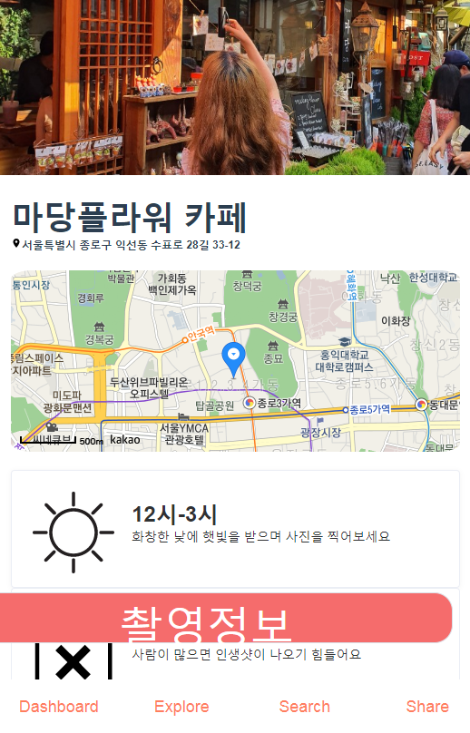

# 우리주위M


## 컴퓨터 구성 / 필수 조건 안내 (Prerequisites)
Make sure you have installed all of the following prerequisites on your development machine:
* Git - [Download & Install Git](https://git-scm.com/downloads). OSX and Linux machines typically have this already installed.
* Node.js - [Download & Install Node.js](https://nodejs.org/en/download/) and the npm package manager. If you encounter any problems, you can also use this [GitHub Gist](https://gist.github.com/isaacs/579814) to install Node.js.


## 설치 안내 (Installation Process)

### Cloning The GitHub Repository
The recommended way to get source is to use git to directly clone the repository:

```bash
$ git clone https://github.com/maemesoft/UriJuwiM.git
```

## 사용법 (Getting Started)

### Project setup
```
npm install
```

### Compiles and hot-reloads for development
```
npm run serve
```

### Compiles and minifies for production
```
npm run build
```

### Lints and fixes files
```
npm run lint
```

### Customize configuration
See [Configuration Reference](https://cli.vuejs.org/config/).

## 파일 정보 및 목록 (File Manifest)

```sh
├─UriJuwiM
│  │ README.md, .gitignore, package.json, vue.config.js, ...
│  ├─ node_modules/vue-daum-map  <  (https://github.com/okchangwon/vue-daum-map)
│  ├─ public
│  │     index.html
│  │     favicon.ico
│  │     example.png // useless..?
│  ├─ reference
│  │     image files for README.md
│  │
│  ├─ src // Based Vue, App.vue and main.js ...
│      ├─ assets
│      │    ├─ icon // svg Vector files
│      │    ├─ img // image files
│      │    ├─ svg // svg Vector files (deprecated)
│      │
│      │
│      ├─ components // componenets file
│      ├─ plugins
│      ├      element.js // element ui plugin (https://element.eleme.io/#/en-US)
│      ├─ router
│      │      index.js // manage vue-router
│      ├─ store  
│      │      index.js // manage vuex
│      ├─ Views
│      │      Intro.vue     //  if './' domain root, print intro and go to dashboard
│      │      Nav.vue       //  Navigation bar
│      │      Dashboard.vue //  './dashboard'
│      │      Explore.vue   //  './explore'
│      │      Search.vue    //  './search'
│      │      Share.vue     //  './share'
│      │
```

### Theme Color Concept



## 저작권 및 사용권 정보 (Copyright / End User License)
This program is free software: you can redistribute it and/or modify
it under the terms of the GNU General Public License as published by
the Free Software Foundation, either version 3 of the License, or
(at your option) any later version.
 
This program is distributed in the hope that it will be useful,
but WITHOUT ANY WARRANTY; without even the implied warranty of
MERCHANTABILITY or FITNESS FOR A PARTICULAR PURPOSE.  See the
GNU General Public License for more details.

You should have received a copy of the GNU General Public License
along with this program.  If not, see <http://www.gnu.org/licenses/>

## 배포자 및 개발자의 연락처 정보 (Contact Information)
JeongHunHa's Email - maemenaver@gmail.com

## 알려진 버그 (Known Issues)

# Occasionally the button will behave abnormally.


## 문제 발생에 대한 해결책 (Troubleshooting)
Please restart the computer and server, sites.
And, if the problem reveal again, please contact to email(maemenaver@gmail.com)

## 크레딧 (Credit)
This open source software created by the Military Soldier Open SW Collective Education Program.

## 업데이트 정보 (Change Log)
link : https://github.com/maemesoft/UriJuwiM/commits/master


